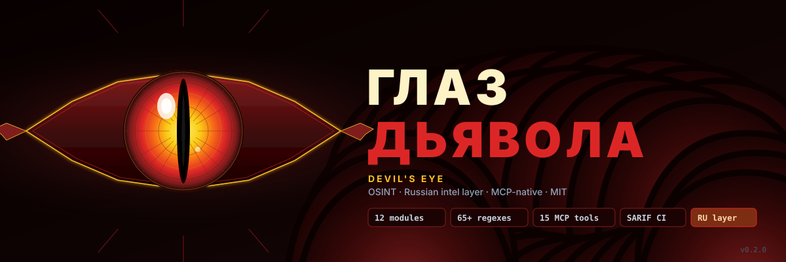

# Глаз Дьявола / Devil's Eye

> OSINT-инструмент с **русскоязычным контуром**: ЕГРЮЛ/ФССП/Яндекс/VK/Telegram, RU-банки и Госуслуги — рядом с универсальными модулями (DNS, subdomains, secrets v2, identity-fabric, web attack-surface, AI/LLM 2026, read-only credential validators, WHOIS/RDAP, passive DNS, TLD enum). Python CLI + MCP-сервер (15 tools). MIT.

[Русский](#русский) · [English](#english)

---

## Русский

### Что это

`Глаз Дьявола` — модульный OSINT-инструмент для **пассивной разведки и read-only валидации** в авторизованных задачах: bug-bounty, ASM-инвентаризация, due-diligence, threat-intel, OSINT-журналистика, защитная инвентаризация собственной поверхности атаки.

**Скоуп — OSINT.** Без активной эксплуатации, brute-force, post-exploitation и evasion. См. [`SECURITY.md`](SECURITY.md).

### Что внутри

#### Универсальные модули

| Модуль | Что делает |
|---|---|
| `dns` | A/AAAA/MX/NS/TXT/SOA, реверс-PTR, CAA, доверенные DNS-резолверы (Cloudflare/Quad9/Google) + DNSSEC |
| `email-sec` | SPF/DMARC/DKIM/BIMI/MTA-STS/TLS-RPT аудит с разбором политик |
| `subdomains` | crt.sh + 5 fallback-источников (OTX, ThreatMiner, HackerTarget, RapidDNS, Wayback) |
| `secrets` | **65+ regex-паттернов** + Шеннон-энтропия + SARIF/JSON/JSONL + дедуп + baseline + multiproc |
| `identity` | Entra/Azure AD + Okta + ADFS + Google Workspace OIDC fingerprints |
| `web` | **Web attack-surface**: 28 Swagger/OpenAPI путей, 13 GraphQL + introspection, JS-endpoint extract, security-headers audit |
| `ai` | Каталог секретов 2026: Mistral/Cohere/Together/Replicate/Fireworks/RunPod/DeepSeek + экспонированные LangSmith/Dify/Flowise/Open-WebUI |
| `validators` | **9 read-only validator'ов**: AWS sts/GetCallerIdentity, GitHub /user, GitLab /user, Slack auth.test, Anthropic, OpenAI, Postman, Atlassian, Datadog, npm. Подтверждает «секрет живой или протух». |
| `discovery` | WHOIS/RDAP (15 TLD), passive DNS (3 источника), TLD enum (35 TLD) |

#### 🇷🇺 RU-слой (главное преимущество)

| Подмодуль | Что делает |
|---|---|
| `ru.egrul` | DaData / egrul.nalog.ru — ЮЛ/ИП по ИНН/ОГРН/названию |
| `ru.fssp` | ФССП — поиск исполнительных производств (нужен `FSSP_TOKEN`) |
| `ru.vk` | VK Open API + parser публичной страницы — резолв screen_name |
| `ru.tg` | Telegram public lookup `t.me/<username>` — тип, описание, число подписчиков |
| `ru.yandex` | Yandex footprint: Metrika ID, Yandex Cloud/CDN, бизнес-почта на Яндексе |
| `ru.banks` | БИК → банк (топ-50), BIN/IIN карт (МИР/VISA/MC/UnionPay/AmEx + RU-эмитенты), SSO-fingerprints |
| `ru.gov` | Классификация .gov.ru/.mos.ru/.mil.ru/.kremlin.ru/Госуслуг + ЕСИА-интеграция |
| `ru.phones` | RU-телефоны: E.164 normalize + оператор (МТС/МегаФон/Билайн/Tele2) + регион |

### Установка

```bash
git clone https://github.com/vladimir/glaz-dyavola.git
cd glaz-dyavola
pip install -e .

# Опционально: MCP-сервер для интеграции с Claude / локальной LLM
pip install -e ".[mcp]"
```

### Быстрый старт

```bash
# Универсальные
glaz dns example.com                     # A/AAAA/MX/NS/TXT + DNSSEC
glaz email-sec example.com               # SPF/DMARC/DKIM/MTA-STS audit
glaz subdomains example.com              # 6 источников
glaz secrets ./repo --sarif out.sarif    # 65+ паттернов + энтропия
glaz identity example.com                # Entra/Okta/ADFS
glaz web https://example.com             # Swagger + GraphQL + headers
glaz ai-exposure host:11434              # Open-WebUI/Ollama/Dify/Flowise

# Discovery
glaz discovery whois example.com
glaz discovery pdns example.com
glaz discovery tld acme                  # acme.com .net .ru .io ...

# Валидация найденного токена (read-only)
glaz validate github --token ghp_xxx
glaz validate aws --token AKIA... --secret xxx

# 🇷🇺 RU
glaz ru egrul --inn 7707083893
glaz ru phone "+7 916 123 45 67"
glaz ru tg durov
glaz ru yandex example.ru
glaz ru bic 044525225
glaz ru card "4279 0100 0000 0000"
glaz ru fssp --lastname Иванов --firstname Иван   # нужен FSSP_TOKEN

# Полный пас (комбо-отчёт)
glaz scan example.com --output report.json
```

### MCP-сервер

```bash
# Запуск MCP-сервера
glaz mcp serve --stdio

# Подключение к Claude Code
# В ~/.claude/settings.json:
# "mcpServers": { "glaz": { "command": "glaz", "args": ["mcp", "serve", "--stdio"] } }
```

Локальная LLM (через Open-WebUI / vLLM с tool-calling) — точно так же, MCP это стандартный протокол.

### Структура

```
glaz-dyavola/
├── glaz/
│   ├── core/           # asset graph, findings, output (JSON/SARIF/HTML)
│   ├── modules/
│   │   ├── dns/
│   │   ├── subdomains/
│   │   ├── secrets/
│   │   ├── email_sec/
│   │   ├── identity/
│   │   ├── ru/         # ★ русскоязычный контур
│   │   └── ai/
│   ├── mcp/            # MCP-сервер
│   ├── utils/
│   └── cli.py
├── tests/
├── docs/
└── .github/workflows/
```

### Авторизация

Инструмент применяется **только** к активам, которыми вы владеете или на которые есть письменное разрешение (RoE, in-scope BB, ASM-контракт, открытые регистры юрлиц). Подробнее — [`SECURITY.md`](SECURITY.md).

### Вдохновение

Архитектурно вдохновлено [Claude-OSINT](https://github.com/elementalsouls/Claude-OSINT) от ElementalSoul (модель asset-graph, severity-rubric). `Глаз Дьявола` это **независимая Python-имплементация** с фокусом на русскоязычный контур + MCP-интеграция; код мой собственный, лицензия MIT.

### Roadmap

В разработке: дополнительные OSINT-модули — расширение people-OSINT, breach-correlation, deeper RU coverage (СПАРК/Контур через API-ключи). Скоуп остаётся пассивная разведка (см. [`SECURITY.md`](SECURITY.md)).

### Лицензия

[MIT](LICENSE) © 2026 Vladimir

---

## English

### What it is

`Devil's Eye` is a modular OSINT tool for **passive reconnaissance and read-only validation** in authorized engagements: bug-bounty, ASM inventory, due-diligence, threat-intel, defensive surface mapping.

**Scope — OSINT.** No active exploitation, brute-force, post-exploitation, or evasion. See [`SECURITY.md`](SECURITY.md).

### Highlights

- 🇷🇺 **Russian OSINT layer** — first-class coverage of EGRUL/FNS/Kontur/Checko, VK, Yandex stack, Telegram public, RU banks/SSO, gov.ru. This is where most Western OSINT tools have a 2-link gap.
- **60+ secret regex patterns** + Shannon entropy filter + SARIF output for CI integration.
- **MCP server** — every module exposed as a tool to Claude / local LLM (Qwen, Llama, Mistral) with tool-calling.
- **Modular CLI** — Typer-based, JSON/JSONL/SARIF/HTML output, asset-graph model.
- **Identity-fabric fingerprinting** — Entra/Okta/ADFS/Google Workspace/generic OIDC.
- **AI/LLM 2026 catalog** — Mistral, Cohere, Together, Replicate, Fireworks, RunPod, DeepSeek + exposed LangSmith/Dify/Flowise/Open-WebUI instances.

### Install

```bash
git clone https://github.com/vladimir/glaz-dyavola.git
cd glaz-dyavola
pip install -e ".[mcp]"
```

### Quick start

```bash
glaz dns example.com
glaz subdomains example.com
glaz secrets ./repo --sarif out.sarif
glaz identity example.com
glaz scan example.com --output report.json
```

### Inspiration

Architectural inspiration from [Claude-OSINT](https://github.com/elementalsouls/Claude-OSINT) by ElementalSoul (asset-graph model, severity rubric). `Devil's Eye` is an **independent Python implementation** focused on the Russian OSINT layer + MCP integration; codebase is original, MIT-licensed.

### License

[MIT](LICENSE) © 2026 Vladimir
